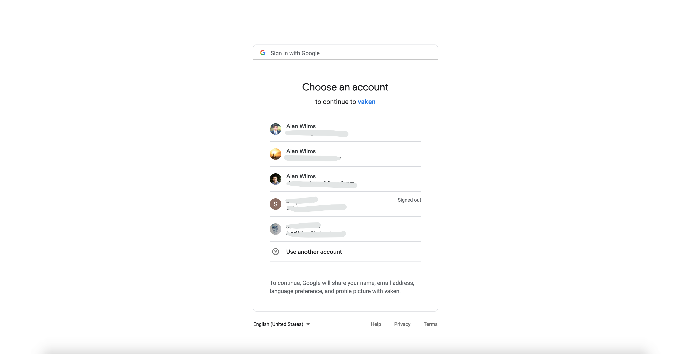
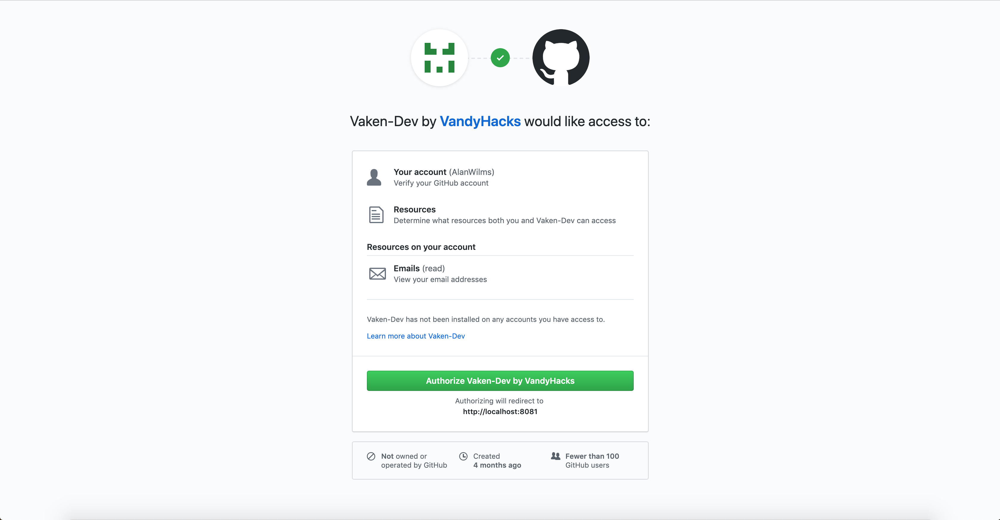
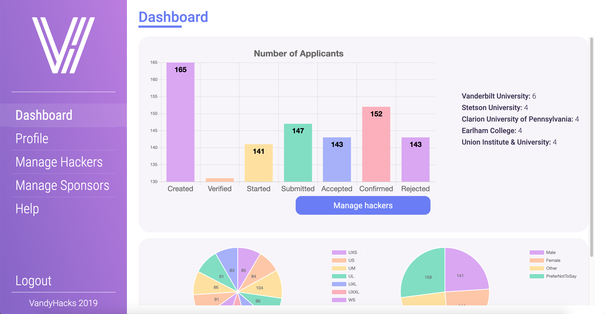
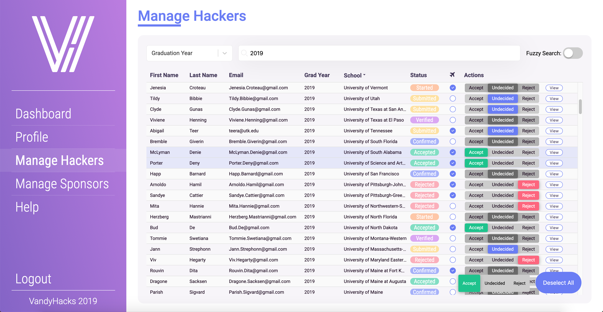
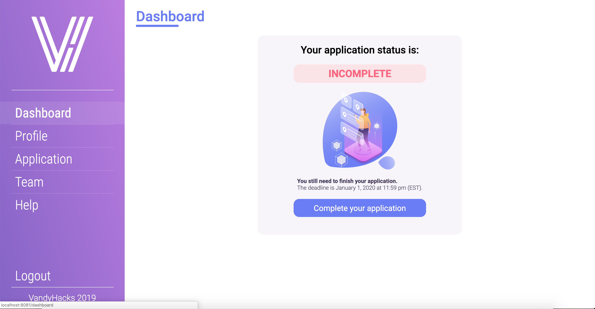
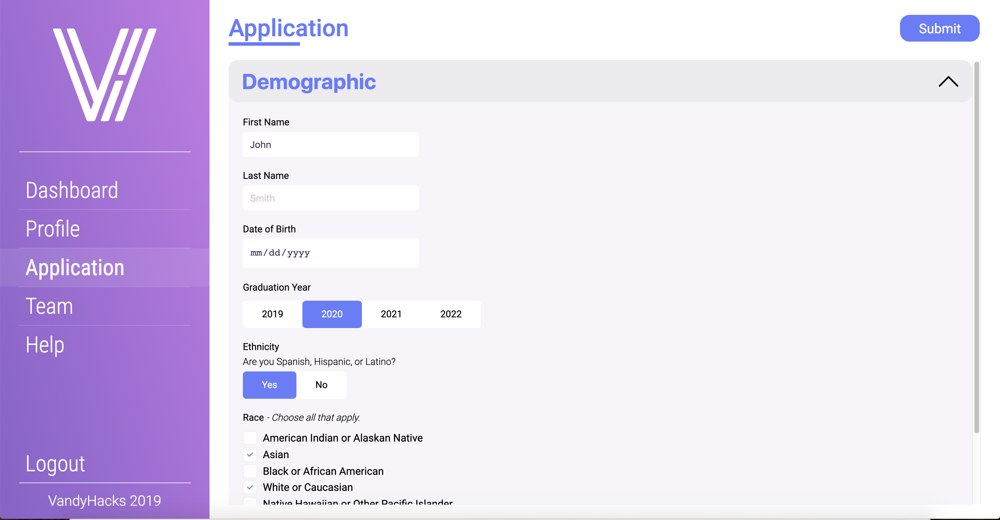
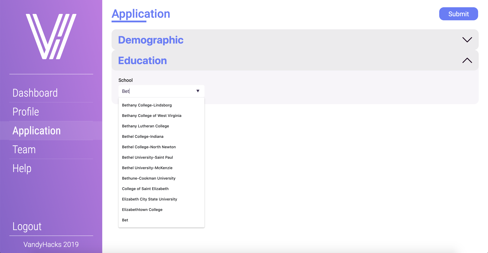
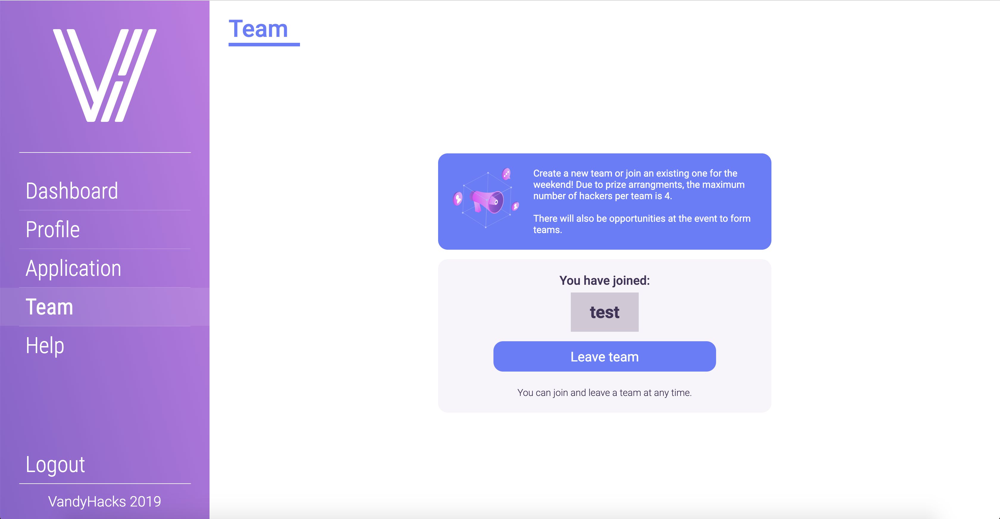

# Vaken

To run:
Create a mongoDB instance on port 27017.

```
npm i && npm run start
```
Separately on a new terminal window or tab:
```
npm run dev-server
```

You may have to manually update auth-level to see the organizer view via the mongoDB console:
```
db.users.update({ "email": "EMAIL_ADDRESS"}, { $set: {"authLevel": "Organizer"}})
```

## Common View





## Organizer View



## Hacker View





Note: all data in screenshots is dummy.
